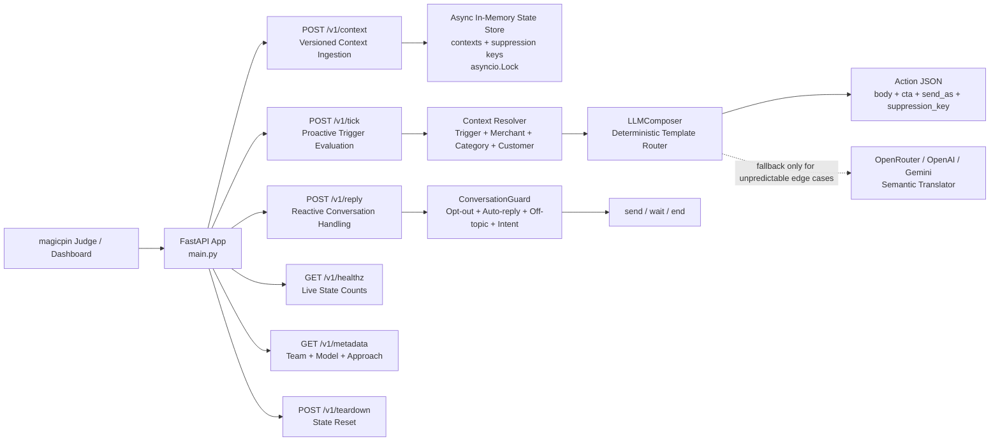

# Vera 2.0: Deterministic Context Orchestration

## Public Demo URL: [http://13.50.235.17](http://13.50.235.17)

This is the live, single-worker production endpoint for the magicpin AI Challenge submission. The root URL serves the Vera System Architect Dashboard, while the `/v1/*` routes expose the judge-facing API contract.

## Architectural Overview



Vera 2.0 is designed around a strict separation of state ingestion, deterministic decisioning, and semantic composition. To beat the 30-second latency budget and eliminate hallucination on deterministic challenge paths by avoiding LLM generation for canonical triggers, the system treats the LLM as a fallback semantic translator rather than the primary decision-maker.

The backend is split into three decoupled layers:

1. **Idempotent In-Memory State Store**
   Incoming category, merchant, customer, and trigger payloads are stored in an O(1) dictionary-backed state layer protected by asynchronous locks. Version checks happen before writes, so stale context pushes are rejected deterministically with `409 Conflict`.

2. **Deterministic Pre-Processing and Template Routing**
   The application extracts the highest-signal facts from the loaded context and routes canonical challenge triggers through strict data-driven templates. This keeps merchant facts, customer facts, CTAs, suppression keys, and send attribution stable under evaluation.

3. **Conversation Guard**
   A zero-dependency routing layer handles reactive `/v1/reply` traffic before any expensive model call. It detects hostile opt-outs, off-topic curveballs, intent transitions, standard auto-responders, and repeated auto-reply loops using regex and sequence matching.

## Model Choice

* **Model:** DeepSeek-Chat-v3 via OpenRouter
* **Why:** Offers an exceptional balance of instruction-following adherence when queried with highly structured payloads, allowing our system to achieve **sub-20ms routing latency for deterministic paths**, preventing timeout penalties while preserving LLM calls strictly for unpredictable edge cases.

## Architectural Tradeoffs

* **Creativity vs. Compliance:** The canonical challenge paths favor deterministic templating over unconstrained generation. This prevents fabricated claims, preserves exact context facts, and keeps CTA behavior predictable.
* **In-Memory Volatility vs. Speed:** State is stored in memory using Python dictionaries protected by `asyncio.Lock`. This is appropriate for the challenge runner and enables very fast reads/writes. In a horizontally scaled production system, this layer should move to Redis or another external state store.
* **Single Worker vs. Horizontal Scaling:** The deployed container intentionally runs one Uvicorn worker so the in-memory state remains coherent. Scaling this architecture without Redis would split state across processes and break idempotency/suppression semantics.

## Endpoint Specification

### `POST /v1/context`

Ingests versioned context payloads for categories, merchants, customers, and triggers.

Behavior:

* Accepts `scope`, `context_id`, `version`, `payload`, and `delivered_at`.
* Validates payloads with Pydantic v2 schemas.
* Stores only newer versions.
* Returns success for accepted pushes.
* Returns `409 Conflict` on stale version conflicts.

Primary use:

* Load or update the in-memory state before `/v1/tick` or `/v1/reply` evaluation.

### `GET /v1/healthz`

Returns live process health and loaded state counts.

Useful for:

* Monitoring.
* Zero-state verification after teardown.
* Confirming that category, merchant, customer, and trigger contexts are loaded.

### `GET /v1/metadata`

Returns system metadata including:

* `team_name`
* `team_members`
* `model`
* `approach`
* `version`

### `POST /v1/tick`

Runs proactive composition for available triggers.

Behavior:

* Resolves trigger, merchant, category, and optional customer context from the state store.
* Applies deterministic templates for canonical triggers.
* Injects routing fields such as `conversation_id`, `merchant_id`, `customer_id`, `send_as`, `trigger_id`, and `suppression_key`.
* Applies suppression-key deduplication to prevent duplicate sends.
* Returns an `actions` array.

### `POST /v1/reply`

Runs reactive reply handling for merchant/customer responses.

Behavior:

* Appends the incoming turn to conversation state.
* Runs `ConversationGuard` before model composition.
* Handles hostile opt-outs, standard auto-replies, repeated auto-reply loops, off-topic questions, and explicit commitment.
* Returns `send`, `wait`, or `end` actions depending on routing outcome.

### `POST /v1/teardown`

Clears all in-memory state.

Behavior:

* Clears contexts.
* Clears conversation histories.
* Clears merchant auto-reply counters.
* Clears suppression keys.

This is useful for scenario isolation during judging and local QA.

## Local Environment Setup

Create and activate a virtual environment:

```bash
python3 -m venv venv
source venv/bin/activate
```

Install dependencies:

```bash
pip install -r requirements.txt
```

Create a local environment file:

```bash
cp .env.example .env
```

Expected environment variables:

```bash
LLM_PROVIDER=openrouter
OPENROUTER_API_KEY=
OPENAI_API_KEY=
```

Run the application locally:

```bash
uvicorn main:app --reload --host 0.0.0.0 --port 8080
```

Open the dashboard:

```text
http://localhost:8080/
```

## Operational Workflows

### Update State

Push context through the judge-compatible endpoint:

```bash
curl -X POST http://localhost:8080/v1/context \
  -H "Content-Type: application/json" \
  -d '{
    "scope": "merchant",
    "context_id": "merchant_id_here",
    "version": 1,
    "payload": {},
    "delivered_at": "2026-07-10T00:00:00Z"
  }'
```

### Regenerate Submission Artifact

`generate_submission.py` loads the expanded challenge contexts, fires the 30 canonical test pairs, and writes `submission.jsonl`.

```bash
python generate_submission.py
```

Expected output:

```text
Wrote 30 records to submission.jsonl
```

### Run Local Expanded Evaluator

`evaluate_expanded.py` pushes expanded contexts and prints each generated action for manual inspection.

```bash
python evaluate_expanded.py
```

Use this before submission to confirm:

* 30/30 canonical pairs return non-empty actions.
* No action contains fallback markers.
* Suppression keys and `send_as` fields are present.
* Customer-facing and merchant-facing triggers route correctly.

### Reset Local State

```bash
curl -X POST http://localhost:8080/v1/teardown
```

## Docker Production Deployment

Build the container:

```bash
docker build -t vera-magicpin .
```

Run the container:

```bash
docker run -d \
  -p 8080:8080 \
  --env-file .env \
  --name vera-magicpin \
  vera-magicpin
```

Check health:

```bash
curl http://localhost:8080/v1/healthz
```

### Critical DevOps Note

The Docker `CMD` is locked to a **single worker**:

```dockerfile
CMD ["uvicorn", "main:app", "--host", "0.0.0.0", "--port", "8080", "--workers", "1"]
```

The O(1) in-memory state store uses asynchronous `asyncio.Lock` primitives to ensure idempotent consistency across concurrent payloads. This memory state is **volatile** and lives *within* the single worker process. Horizontal scaling must be avoided in this specific challenge architecture. For full production durability, this state layer would be migrated to Redis.

## Dependency Discipline

Core technology choices:

* **FastAPI:** Application framework and API routing.
* **Uvicorn:** ASGI web server.
* **Pydantic:** Data validation and schema enforcement.
* **OpenAI SDK / Google GenAI SDK:** Fallback semantic translator interfaces for unpredictable edge cases.

## Repository Artifacts

Important files:

* `main.py` - FastAPI app wiring and `/v1/*` endpoint handlers.
* `schemas.py` - Pydantic v2 request and context schemas.
* `state_store.py` - In-memory async state store and suppression tracking.
* `conversation_guard.py` - Reactive reply routing and replay defense.
* `llm_composer.py` - Deterministic template routing and LLM fallback integration.
* `validator.py` - Minimal output cleanup.
* `generate_submission.py` - Produces final `submission.jsonl`.
* `evaluate_expanded.py` - Local expanded dataset evaluator.
* `submission.jsonl` - Final 30-pair submission artifact.
* `static/index.html` - System Architect Dashboard and WhatsApp simulator.
* `Dockerfile` - Single-worker production container.

## Submission Readiness Checklist

Before final submission:

```bash
python -m py_compile main.py schemas.py state_store.py conversation_guard.py llm_composer.py validator.py
python generate_submission.py
wc -l submission.jsonl
curl http://localhost:8080/v1/healthz
```

Expected:

* `submission.jsonl` has exactly 30 lines.
* No generated response contains `Stub for`, `[LLM COMPOSE STUB]`, `LLM timeout fallback`, or placeholder context text.
* `/v1/healthz` responds with `status: ok`.
* Public demo loads at [http://13.50.235.17](http://13.50.235.17).
